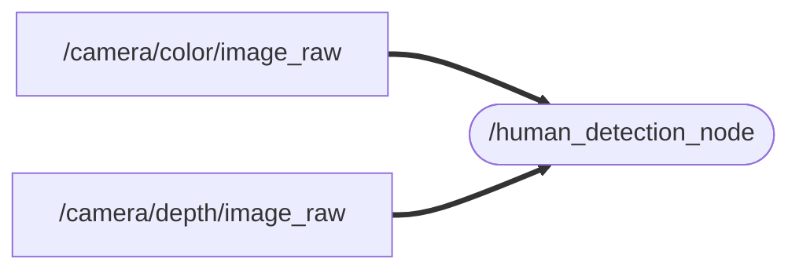

# human_detection_yolov8
YOLOv8 を使用して人物を検出し、対象の人物が 2m 以内にいる場合に「人検知」と表示する
### Node and Topic

## Dependency
    sudo apt install ros-$ROS_DISTRO-cv-bridge

    ros-$ROS_DISTRO-image-transport
## Setup
    cd ~/ros2_ws/src  #Go to ros workspace

    git clone https://github.com/iHaruruki/human_detection_yolov8.git #clone this package

    cd ~/ros2_ws

    colcon build --symlink-install

    source install/setup.bash

## Usage
    ros2 launch astra_camera astra_pro.launch.xml

    ros2 run human_detection_yolov8 human_detection_node

## License
## Authors
## References
