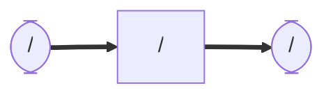

# human_detection_yolov8
### Node and Topic

## Dependency
## Setup
    cd ~/ros2_ws/src  #Go to ros workspace

    git clone  #clone this package

    cd ~/ros2_ws

    colcon build --symlink-install

    source install/setup.bash

## Usage
```
```
## License
## Authors
## References
